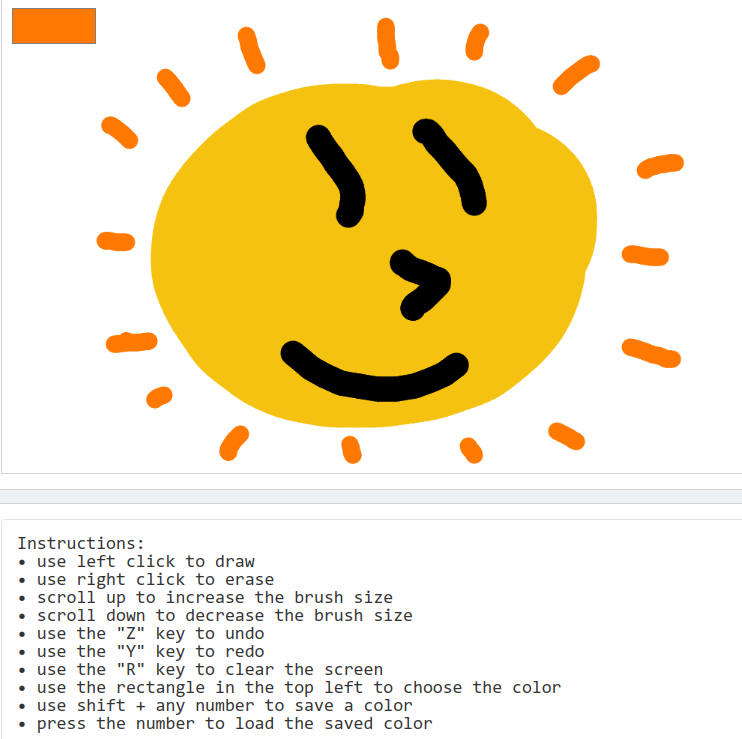

# Art Program
A simple browser drawing program using the CodeHS library with erasing, brush size, undo/redo, and colors. Made for the AP Computer Science Principles test in January 2024. [Click here to try it out!](https://codehs.com/share/id/component-a-program-code-javascript-zCogiC/run)

